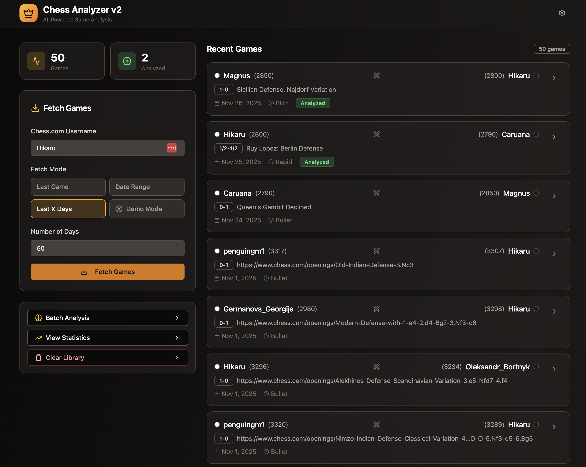
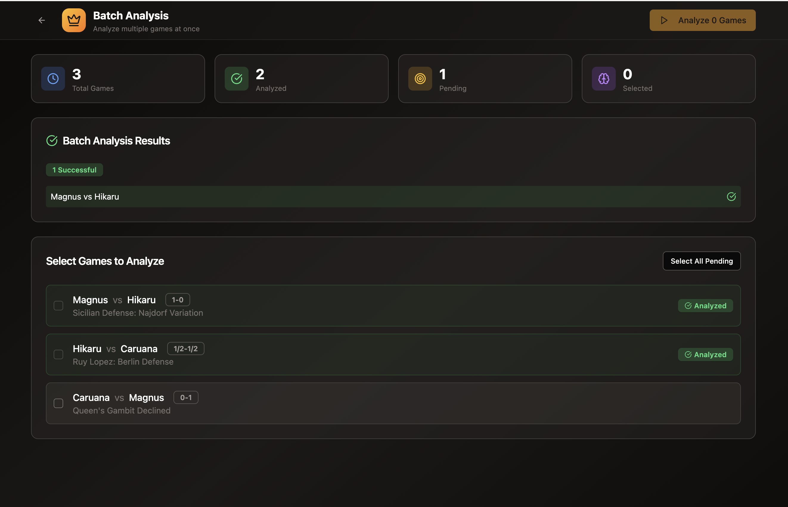
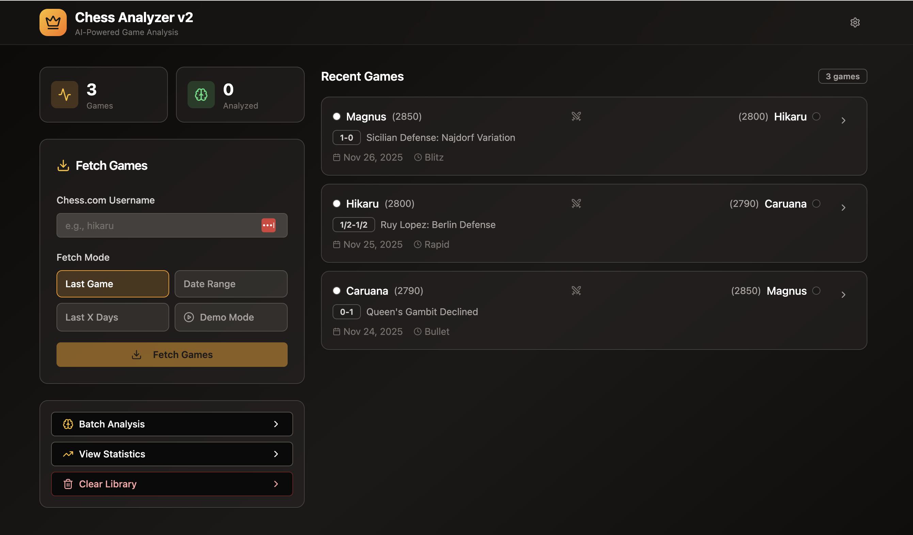
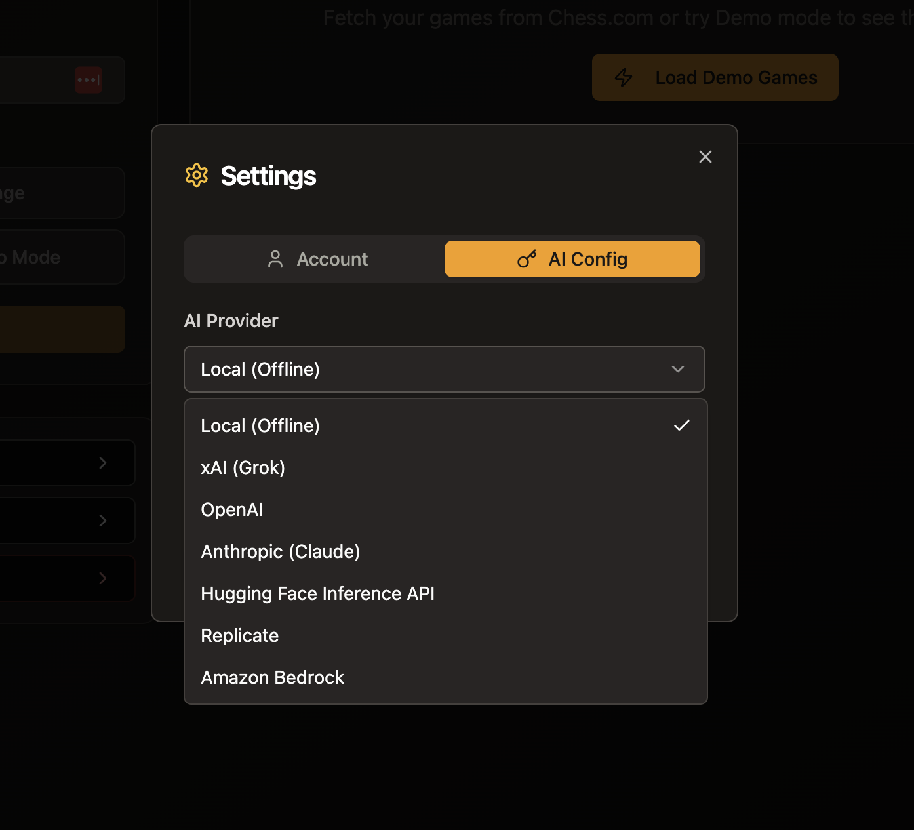
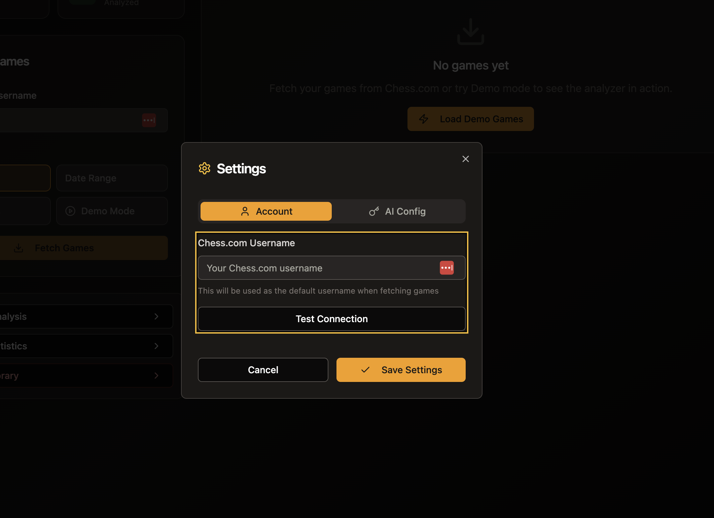
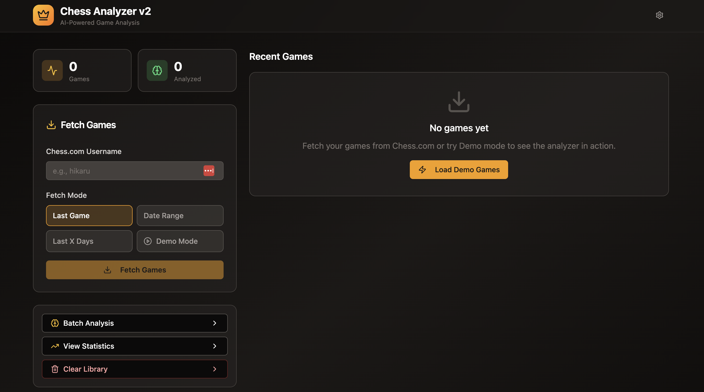

# Chess Analyzer v2

A Vite + React experience for importing Chess.com games, running lightweight AI-style analysis in the browser, and exploring performance trends through rich UI components.

## Platform Highlights

- **Game ingestion**: Pull recent games directly from Chess.com or load curated demo games to explore the interface instantly.
- **Local analysis engine**: `src/api/analysisEngine.js` inspects PGNs, flags blunders/mistakes, estimates accuracy, and produces actionable coaching notes without calling external LLMs.
- **Persistent library**: Games, analyses, and profile settings are saved to browser `localStorage` via `src/api/platformClient.js`, so refreshes keep your data intact.
- **Dashboards & insights**: Batch processing flows, per-game deep dives, and statistics pages provide timelines, accuracy charts, opening breakdowns, and more.
- **Modern UI toolkit**: Tailwind CSS, shadcn/ui primitives, Lucide icons, and custom chess widgets deliver a cohesive, responsive layout.

## UI Tour

### Dashboard — Loaded Library
This state shows a full library of 50 stored games with two completed analyses. The fetch form is prefilled for Hikaru’s last 60 days, and each card lists the opponent, opening (e.g., Najdorf, Berlin), and analysis status so it’s clear which game to open next.



### Statistics Overview
Key metrics summarize a 33.3% win rate, 87.5% average accuracy, and zero blunders or mistakes per game. A donut chart shows the win/loss/draw breakdown, while the bar chart highlights the time-control mix between Blitz and Bullet.


### Batch Analysis Queue
The batch view tracks three total games, with two already analyzed and one still pending. Each PGN (Magnus vs Hikaru, Hikaru vs Caruana, etc.) keeps its own “Analyzed” badge so you can rerun only the remaining games, while the green banner confirms recent batch successes.



### Game Analysis Deep Dive
The Hikaru vs Caruana Berlin Defense replay syncs the interactive board, move list, opening code (C65), and AI coach insights. Accuracy, summary chips (50 moves, zero blunders, zero mistakes), and time control all stay visible so you can review every move in context.


### Dashboard — Recent Fetch
With only three games loaded, the dashboard still offers the same fetch controls plus compact cards for Magnus vs Hikaru, Hikaru vs Caruana, and Caruana vs Magnus. It’s ideal for a small import before running batch analysis or checking statistics.



### Settings — AI Provider Config
The AI Config tab displays the full list of supported providers—Local (offline), xAI Grok, OpenAI, Anthropic (Claude), Hugging Face Inference API, Replicate, and Amazon Bedrock—so users know exactly which credentials they can plug in for richer analysis.



### Settings — Chess.com Account (Success)
After entering a Chess.com username, the Test Connection button verifies access to the public API and returns a bright green “Connection successful!” message. Saving these settings ensures the fetch form is auto-filled on future visits.


### Settings — Chess.com Account (Blank State)
In the blank state, the account settings modal prompts new users to enter their Chess.com handle. The primary call-to-action is “Test Connection,” encouraging verification before any data is saved.



### Empty Library Onboarding
When no games are stored, the dashboard shows a “No games yet” message in the Recent Games panel and a prominent “Load Demo Games” button, making it clear how to explore the analyzer without connecting a Chess.com account.



## Tech Stack

| Layer | Details |
| --- | --- |
| Build tooling | [Vite](https://vitejs.dev/), PostCSS, Tailwind |
| Framework | React 18, React Router DOM 7 |
| State/data | @tanstack/react-query for async state, custom platform client for persistence |
| UI | Tailwind, shadcn/ui components, Lucide icons |
| Charts | Recharts for accuracy, opening, and result visualizations |

## Quick Start

1. **Install prerequisites** – Node.js 18+ and npm.
2. **Download / unzip** the project.
3. **One-liner (macOS/Linux)**
   ```bash
   chmod +x scripts/install-and-launch.sh  # first time only
   ./scripts/install-and-launch.sh
   ```
   This installs dependencies and launches the dev server on `http://localhost:5173/`.
4. **Windows / manual setup**
   ```bash
   npm install
   npm run dev
   ```
5. When finished, stop the dev server with `Ctrl+C` (or close the terminal tab).

## Getting Started

1. **Install dependencies**
   ```bash
   npm install
   ```
2. **Run the dev server**
   ```bash
   npm run dev
   ```
   Vite prints a local URL (typically http://localhost:5173). Open it in a modern browser.
3. **Build for production**
   ```bash
   npm run build
   npm run preview
   ```
   `preview` serves the optimized bundle locally so you can sanity-check before deploying to any static host.

> **Note:** No backend services are required. All data lives in the browser, so clearing site data resets the library.

## Testing

Vitest powers the automated test suite.

- `npm test` – Run the suite once in headless mode.
- `npm run test:watch` – Start Vitest in watch mode for local development.
- `npm run lint` – ESLint for static analysis.

Current coverage focuses on:

- `src/api/__tests__/analysisEngine.test.js` – heuristic analysis outputs
- `src/components/chess/__tests__/GameCard.test.jsx` – recent-games list item rendering
- `src/components/chess/__tests__/FetchGamesForm.test.jsx` – Dashboard fetch workflow interactions
- `src/pages/__tests__/Dashboard.test.jsx` – React Query driven dashboard data flows

Vitest enforces minimum coverage thresholds (60% statements/lines, 40% branches/functions). Extend the suites alongside these files to keep the quality gates green.

When the suite runs, coverage artifacts are written to `coverage/` (including `coverage/lcov.info`). Feed that LCOV file into your CI pipeline or coverage service of choice for historical reporting.

## Continuous Integration & Coverage Uploads

`.github/workflows/ci.yml` runs on every push (main/master) and pull request:

1. Install dependencies via `npm ci`.
2. Execute `npm test` (Vitest with coverage enabled).
3. Upload `coverage/lcov.info` to Codecov using `codecov/codecov-action@v4`.

To activate the upload step, create a `CODECOV_TOKEN` repository secret (from your Codecov project settings). Without the token the action will fail, so set it before merging CI changes into your default branch.

## Data & Storage Model

`src/api/platformClient.js` abstracts persistence. It exposes `entities.Game`, `entities.Analysis`, and `auth` helpers with simple `list`, `filter`, `create`, and `update` methods. Records are written to the following keys:

- `chess-platform/games`
- `chess-platform/analyses`
- `chess-platform/user`

Because everything runs client-side, writes are optimistic and return after a short artificial latency (≈120 ms) to mimic real network requests.

## Fetching Games from Chess.com

`src/api/gameSources.js` wraps the Chess.com public API:

1. The Dashboard form collects a username plus a fetch mode (last game, range, last X days, or demo).
2. `fetchGamesFromChessCom` pulls the last few monthly archives, filters them based on the selected mode, normalizes PGN metadata, and hands results to the platform client for storage.
3. If the API is unreachable (e.g., CORS blocks), the UI surfaces a friendly error and suggests Demo Mode.

Demo Mode seeds the local store with three famous games defined directly inside `src/pages/Dashboard.jsx`, so every feature can be exercised offline.

## AI-Style Analysis

The analyzer lives in `src/api/analysisEngine.js`:

- Parses moves from each PGN and looks for `?` / `??` annotations to flag mistakes and blunders.
- Estimates accuracy for both colors by combining total move count, outcome, and tactical misses.
- Generates `critical_moments`, `opening_assessment`, and natural-language `coaching_advice` strings.
- Returns results asynchronously so the UI can display progress indicators identical to real AI calls.

> **AI Provider Keys:** The default analyzer runs locally without calling any external model. To enable richer, provider-backed insights, open the in-app **Settings** dialog (gear icon in the header), pick an AI provider, and paste the requested credentials. Without a key you still get the heuristic analysis; with one configured the platform routes analysis requests to your provider. Credentials never leave your browser’s `localStorage`—use a backend proxy for production deployments.

### Connecting External AI Providers

Use these provider-specific checklists to obtain keys and wire them into the Settings dialog. Each entry maps 1:1 to the options inside the **AI Provider** select.

#### Local (Offline)
- Choose “Local (Offline)” when you do not want to call an external provider. No extra fields appear.

#### xAI · Grok
1. Generate an API key from https://console.x.ai/ (Settings → API Keys).
2. Note the model ID you plan to use (`grok-beta`, `grok-2`, etc.).
3. In Settings → AI Config choose **xAI (Grok)**, paste the key, and optionally override the model ID.

#### OpenAI
1. Create a secret key at https://platform.openai.com/account/api-keys.
2. Decide which chat completion model to run (`gpt-4o-mini`, `gpt-4.1`, etc.).
3. Select **OpenAI** in the dialog, paste the key, and enter the model ID.

#### Anthropic (Claude)
1. Visit https://console.anthropic.com/ and create an API key.
2. Copy your target model alias (e.g., `claude-3-5-sonnet-20241022`) and the API version header (`2023-06-01` by default).
3. Pick **Anthropic (Claude)**, fill in the model ID, optional version override, and API key.

#### Hugging Face Inference API
1. Create a Personal Access Token with `read` scope at https://huggingface.co/settings/tokens.
2. Copy the model slug you want (for example `mistralai/Mistral-7B-Instruct`).
3. Choose **Hugging Face Inference API** and enter both the model ID and token.

#### Replicate
1. Generate a token from https://replicate.com/account/api-tokens.
2. Copy the model slug (`owner/name`) and version hash.
3. Select **Replicate** in the dialog and fill all three fields (model, version, token).

#### Amazon Bedrock (AWS)
1. Ensure your AWS account/region has Bedrock enabled and you’ve requested access to the desired models.
2. Create IAM credentials with `bedrock:InvokeModel` access and note the region + model IDs (e.g., `anthropic.claude-3-sonnet-20240229-v1:0`).
3. Pick **Amazon Bedrock** and enter the region, model ID, access key, secret key, and optional session token.

> Tip: Credentials are saved to browser storage for demos only. In production, proxy AI calls through a secure backend and keep long-lived keys server-side.

`src/pages/Analysis.jsx` batches multiple games, whereas `src/pages/GameAnalysis.jsx` handles single-game deep dives. Both store their outputs through `platformClient.entities.Analysis`, unlocking the statistics page.

## Application Structure

- `src/pages/` – Route-level views (`Dashboard`, `Analysis`, `GameAnalysis`, `Statistics`).
- `src/components/chess/` – Chess-specific widgets (game cards, PGN viewers, settings modal, evaluation bar, etc.).
- `src/api/` – Platform services (`platformClient`, `analysisEngine`, `gameSources`).
- `src/components/ui/` – shadcn/ui building blocks.
- `src/utils/` – Helpers like `createPageUrl`.

React Router definitions live in `src/pages/index.jsx`, and `src/main.jsx` wires the router plus global providers.

## Typical Workflow

1. Open the Dashboard.
2. Fetch games from Chess.com **or** click “Demo Mode”.
3. Explore recent games, then either:
   - Hit **Batch Analysis** to process multiple games at once, or
   - Click an individual game to open the Game Analysis view.
4. Review AI insights, blunders, and accuracy metrics.
5. Jump to **Statistics** for aggregated trends (win rate, accuracy over time, top openings, time-control breakdowns).
6. Use the Settings dialog to store your default Chess.com username and optional AI provider notes (purely informational at this stage).

## Troubleshooting & Tips

- **No games appear after fetching**: Double-check the Chess.com username spelling. The API is case-insensitive, but private or brand-new accounts may not expose archives yet.
- **Stuck progress overlay**: All async flows rely on React Query. Refreshing the page resets in-flight state because data persists locally.
- **Want a clean slate?** Clear browser storage for the app’s origin or run `localStorage.clear()` in devtools.
- **Extending the analyzer**: Drop new heuristics into `analysisEngine.js` and include extra fields in the returned object; the UI surfaces any additional JSON stored alongside each analysis.

## Contributing / Next Steps

- Replace the heuristic analyzer with a real engine or cloud LLM call.
- Sync data to a backend instead of `localStorage` for multi-device access.
- Add authentication or shareable reports.

Until then, this README should give you everything needed to understand, run, and extend Chess Analyzer v2.
